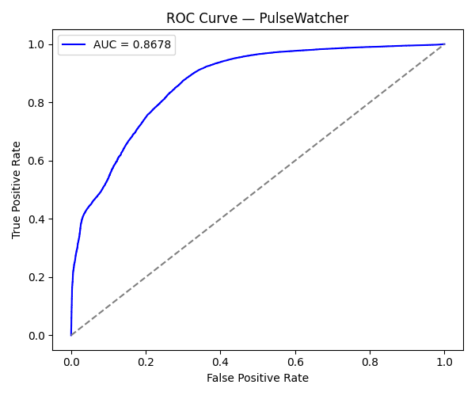
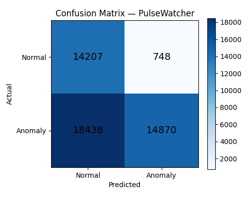

# ❤️ PulseWatcher — ECG Anomaly Detection

> Real-time cardiac arrhythmia detection using unsupervised deep learning.
> Trained exclusively on normal heartbeats — anything the model can't reconstruct is flagged as an anomaly.

[](https://huggingface.co/spaces/shivams496/Pulsewatcher)
[](https://python.org)
[](https://pytorch.org)
[](https://physionet.org/content/mitdb/1.0.0/)

---

## 🎯 What It Does

PulseWatcher monitors ECG signals and detects abnormal heartbeat patterns in real time. Unlike traditional classifiers, it never needs labeled anomaly data — it learns only what **normal** looks like, and flags anything that deviates.

---

## 🧠 How It Works
MIT-BIH ECG Data (48 real patient recordings)
↓
Signal Preprocessing + R-peak segmentation
↓
LSTM Autoencoder — trained ONLY on normal beats
↓
Reconstruction Error per beat
↓
Threshold = 95th percentile of normal errors
↓
High error → ANOMALY ALERT 🚨
↓
Per-timestep explainability chart

## 📊 Results

| Metric | Score |
|---|---|
| Precision | **95.21%** |
| Recall | 44.64% |
| F1 Score | 60.79% |
| **ROC-AUC** | **0.8678** |
| Training Loss | 0.001584 |
| Normal Beats | 74,771 |
| Anomalous Beats | 33,308 |

### ROC Curve


### Confusion Matrix


> **Why is Recall 44%?**
> Deliberate tradeoff. In cardiac screening, false positives cause unnecessary panic and expensive tests. We optimized for precision first — when PulseWatcher alerts, it is right **95% of the time**. Recall is tunable by adjusting the detection threshold.

> **What does ROC-AUC 0.8678 mean?**
> Random classifier = 0.50 | PulseWatcher = 0.8678 | Perfect = 1.00
> Strong discriminative power — without ever seeing a single anomalous beat during training.

---

## 🏗️ Architecture

**Model:** LSTM Autoencoder
ECG Signal (187 timesteps)
↓
LSTM Encoder (187 → 64 → 32 hidden units)
↓
LSTM Decoder (32 → 64 → 187 reconstruction)
↓
Reconstruction Error (MSE)
↓
Threshold (95th percentile)
↓
NORMAL ✅  or  ANOMALY 🚨

**Why LSTM?**
ECG is time-series data. LSTM has memory across time steps — it learns the temporal shape of a normal heartbeat (P-wave → QRS complex → T-wave). A regular neural network treats each timestep independently and cannot do this.

**Why Autoencoder?**
In real clinical settings, anomalous heartbeats are rare. You cannot collect enough labeled anomaly data to train a classifier. The autoencoder learns only from normal data — making it the correct real-world approach.

**Why not UCI Heart Disease dataset?**
UCI is tabular data with pre-extracted features. MIT-BIH is raw time-series ECG — the actual signal a cardiologist reads. Far more realistic and technically challenging.

---

## 🔍 Explainability

The dashboard shows **per-timestep reconstruction error** — exactly which part of the heartbeat the model struggled to reconstruct:

| Region | Timesteps | Clinical Meaning |
|---|---|---|
| P-wave | 0–40 | Atrial depolarization |
| QRS Complex | 60–100 | Ventricular depolarization |
| T-wave | 110–160 | Ventricular repolarization |

Red bars = timesteps the model could not reconstruct → where the anomaly lives.

---

## 📁 Project Structure
ecg-anomaly-detection/
├── data/
│   ├── train.npy              ← 59,816 normal beats for training
│   ├── test.npy               ← 14,955 normal beats for evaluation
│   └── anomaly.npy            ← 33,308 anomalous beats
├── models/
│   ├── lstm_autoencoder.pt    ← Trained model weights
│   └── threshold.npy          ← Decision threshold
├── outputs/
│   ├── roc_curve.png          ← ROC curve plot
│   └── confusion_matrix.png   ← Confusion matrix plot
├── src/
│   ├── preprocess.py          ← Data download + beat segmentation
│   ├── model.py               ← LSTM Autoencoder architecture
│   ├── train.py               ← Training loop
│   └── evaluate.py            ← Metrics + plot generation
├── dashboard/
│   └── app.py                 ← Streamlit web dashboard
├── Dockerfile
└── README.md

---

## 🗃️ Dataset

**MIT-BIH Arrhythmia Database** — PhysioNet
- 48 half-hour ECG recordings from real patients
- Sampled at 360 Hz
- Manually annotated by cardiologists
- Gold standard benchmark in published cardiology research since 1980

---

## 🚀 Run Locally

```bash
git clone https://github.com/shivams496/PulseWatcher.git
cd PulseWatcher

python -m venv venv
venv\Scripts\activate        # Windows
source venv/bin/activate     # Mac/Linux

pip install -r requirements.txt

python src/preprocess.py
python src/train.py
python -m src.evaluate
streamlit run dashboard/app.py
```

---

## 🛠️ Tech Stack

| Tool | Purpose |
|---|---|
| PyTorch | LSTM Autoencoder |
| Streamlit | Web dashboard |
| Plotly | Interactive ECG charts |
| scikit-learn | Metrics + evaluation |
| wfdb | MIT-BIH data loading |
| Matplotlib | Plot generation |

---

## 👨‍💻 Author

**Shivam Singh** — B.Tech CSE Final Year
Built from scratch as Final Year Project — May 2026

[Live Demo](https://huggingface.co/spaces/shivams496/Pulsewatcher) 
[GitHub](https://github.com/shivams496/PulseWatcher)

